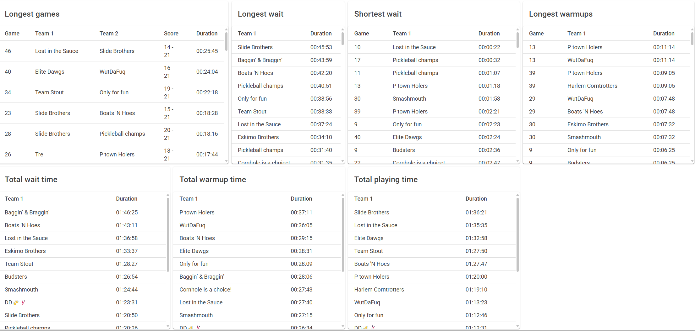

# PCC Stats Winter League 2025 - Week 1

## Introduction, Reality Check & Conclusion

Welcome to the PCC Winter League 2025. This document aims to address concerns raised by returning players and provide insights into the league’s structure and scheduling. With our growing numbers, we recognize the importance of refining our processes to improve the overall experience for all participants.

With our growing numbers, we have experienced some challenges with wait times between games, both last season and this season. These wait times are both actual delays and perceived delays, where the latter may stem from player expectations or previous experiences. In this document, we aim to explain the data and some of the nuances involved in adjusting league parameters.

## Reality Check - Week 1
Lets start with rewieing how week 1 went. Below are the numbers for first week. Unfortunately, we dont have full data for division A because they are running Set Schedule.

| Division | Start | Finish |Avg. Wait Time | Avg. Time to Board | Avg. Game |
| -------- | ----- | ------ |-------------- | ------------------ | --------- |
| B1       | 18:09 | 21:49  |16:36          | 04:31              | 12:40     |
| B2       | 18:09 | 21:36  |18:24          | 03:30              | 12:01     |
| A        | 18:32 | 22:01  |N/A            | N/A                | N/A       |
| C        | 18:04 | 22:24  |24:16          | 03:22              | 13:04     |

The division that suffered the most was **C**, with an average wait time of 24 minutes and a max wait time of 55 minutes. This is not great, and we will take measures to prevent this from happening again.

### Changes

The solution for both Wednesday and Thursday is **more boards**, as increasing the number of available boards ensures smoother rotations, reduces wait times, maintains match flow, and minimizes the impact of longer games on the entire league. Additionally, keeping the number of boards consistent throughout the night is important to avoid disruptions. Changing the number of boards mid-event disrupts matchups and increases wait times. If you would like like to understand why the other changes are not being implemented, please read to the end.

Here are the expected completion times with outdoor boards, explaining how they improve wait times:

| Division | Teams | Boards | Time to Complete | Game Duration (inc Warmup/get to bard) | Average Wait Between Games | Expected Finish Time |
| -------- | ----- | ------ | ---------------- | ---------------------------- | ----------------------------------------- | -------------------- |
| B1       | 17    | 5      | 2h 53m           | 17 min                       | 13 min                                    | 20:53                |
| B2       | 8     | 2      | 3h 24m           | 17 min                       | 17 min                                    | 20:16                |
| A        | 10    | 3      | 2h 50m           | 17 min                       | 11 min                                    | 22:15                |
| C        | 20    | 5      | 3h 24m           | 17 min                       | 17 min                                    | 21:24                |

We recommend that **A division play one court outside** while **B2 does not play outside**. The reason is that **A division follows a set schedule**, allowing for structured matchups and better utilization of three boards. Having two additional teams in A also ensures a more consistent availability of matchups, reducing delays. **B2 has only eight teams**, and to maintain smooth matchups, at least four teams should always be in the queue. Playing outside could disrupt match scheduling, making it harder to ensure fair rotations. If A division are fine with 4:15 total time, we can play a on 2 boards and you get boards when C is COMPLETELY done. B2 and C have the magic, play one wait one ratio that is pretty nice to to slow not to fast IMHO.

All divisions will start at 6pm, with warmups starting at 5pm. You can see below on why staggered starts does not help.

Also I wrote a software to keep track of wait times, Board ready, and match durations down on team level for B and C divisions so we will be able to track what these changes mean. If it does not help significantly, this solution we will try something really drastic, hopefully we it wont come to that.

### How Long is Too Long?

Determining what constitutes a long wait time can be subjective. However, we can establish a baseline using data from past seasons and Scoreholio's expected timings. PCC has always been a club that plays in a bar setting, where socializing is as important as playing cornhole. The venue provides free space in exchange for food and drink sales, so remember to tip your bartenders! However, this environment also influences pacing, as games do not run on a strict clock like in tournament formats. Now, let's dig into the data, starting with the B1 division.

### How did we compare to what Scoreholio estimated?

To understand the ideal pace, we refer to Scoreholio’s expected game durations, which factor in average match lengths and board availability. Below is the expected time to complete the night based on our club's setup and global Scoreholio Data. This assumes a static number of boards throughout the night and incorporates our known average game time plus warm-up time.

| Division | Teams | Boards | Time to Complete | Game Duration (ing. Warmup) | Average Wait Between Games (Incl. Warmup) | Expected Finish Time |
| -------- | ----- | ------ | ---------------- | ---------------------------- | ----------------------------------------- | -------------------- |
| B1       | 17    | 4      | 3h 36m           | 17 min                       | 19 min                                    | 21:36                |
| B2       | 8     | 2      | 3h 24m           | 17 min                       | 17 min                                    | 21:24                |
| A        | 10    | 2      | 4h 15m           | 17 min                       | 26 min                                    | 22:15                |
| C        | 20    | 4      | 4h 15m           | 17 min                       | 26 min                                    | 22:15                |

On Thursdays, we need to complete 75 games. This requires 12.5 games per board, with each game taking about 17 minutes. Even if every player was on time with no warm-up, it would still take the same amount of time. Realistically, time spent getting to the court and transitioning between matches is part of the game. Compared to other clubs, we are slightly slower—only by about 30 seconds for both warm-up and match duration.

### What Affects Speed of Play?

Several factors impact the time between games:

1. Number of teams per board ratio
2. Match duration
3. How quickly players start a game after a board becomes available

An additional factor that affects total event duration (but not necessarily wait time between games) is the number of rounds.

### Staggered Starts: Do They Help?

Staggered starts can help align division end times, but they also introduce new challenges. Historically, we have used staggered starts with divisions A and C, where the largest division starts earlier and the smaller division starts later. While this helps synchronize division end times, it also increases wait times for larger divisions at the start and for smaller divisions at the end.

Below is an example of how staggered starts affect wait times based on scoreholio caclulations:

| Division | Time  | Boards | Games Played | Wait Time |
| -------- | ----- | ------ | ------------ | --------- |
| C        | 18:00 | 6      | 20/60        | 11 min    |
| C        | 19:00 | 4      | 33/60        | 27 min    |
| A        | 19:00 | 2      | 7/30         | 27 min    |
| C        | 20:00 | 4      | 46/60        | 27 min    |
| A        | 20:00 | 2      | 14/30        | 27 min    |
| C        | 21:00 | 4      | 60/60        | 27 min    |
| A        | 21:00 | 3      | 24/30        | 12 min    |
| A        | 22:00 | 4      | 30/30        | 12 min    |

Staggered starts only improve wait times at the very beginning and end of the night, as demonstrated in the table above. The only way to make staggered starts work is by delaying the smaller division’s start significantly, which would diminish the league’s social aspect.

### Real data on C last week
|Hour | Wait times |Boards|
|-----|------------|---|
|6-7  |00:08:57|4-6 (6 for 30 min)|
|7-8  |00:22:05|4|
|8-9  |00:24:26|4 (down one about 8:30)|
|9-10 |00:32:29|3|
|10-11|00:33:03|3|

The reason this data isn't linear is that Scoreholio only calculates averages. Many factors influence the results. For example, players tend to play their best and longest games toward the end of the night. When a board is removed from one division, not only is there one less board, but the longer game durations amplify wait times.

For these reasons, we will **not** implement staggered starts solely to address wait times, its not fair the the players that start early.

### B1

### B2

### C
